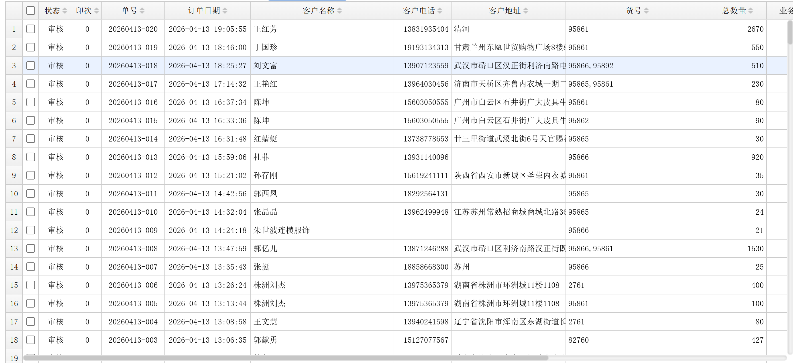
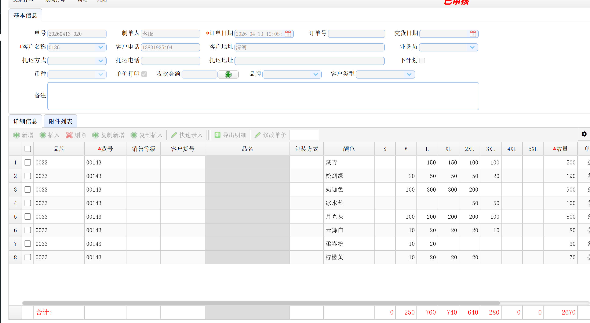
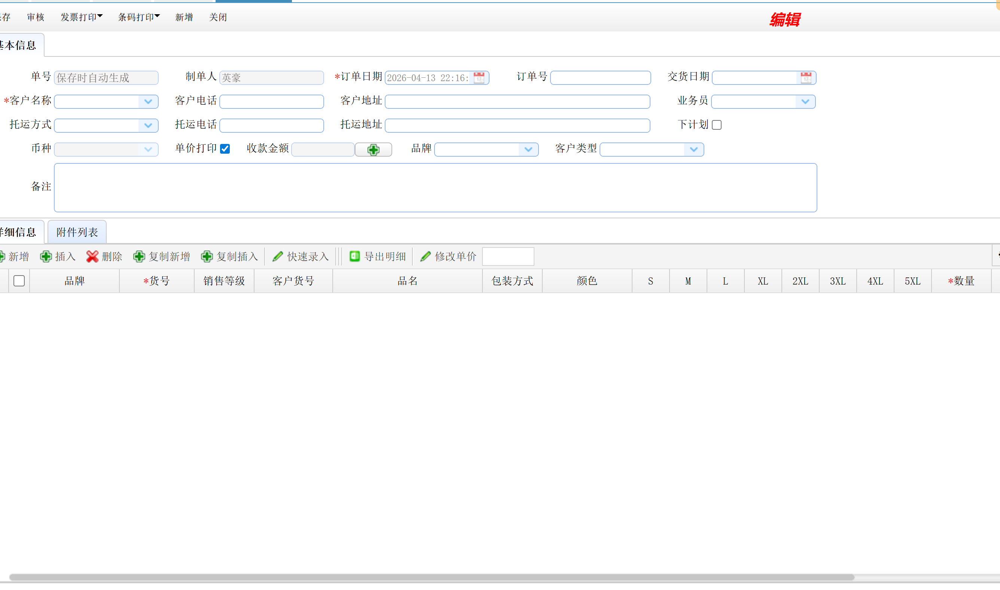
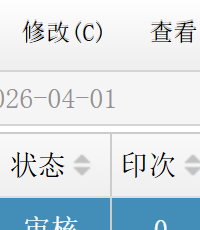
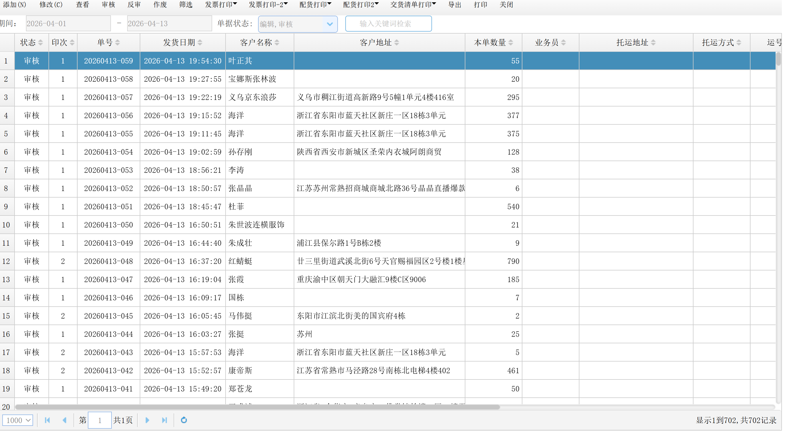
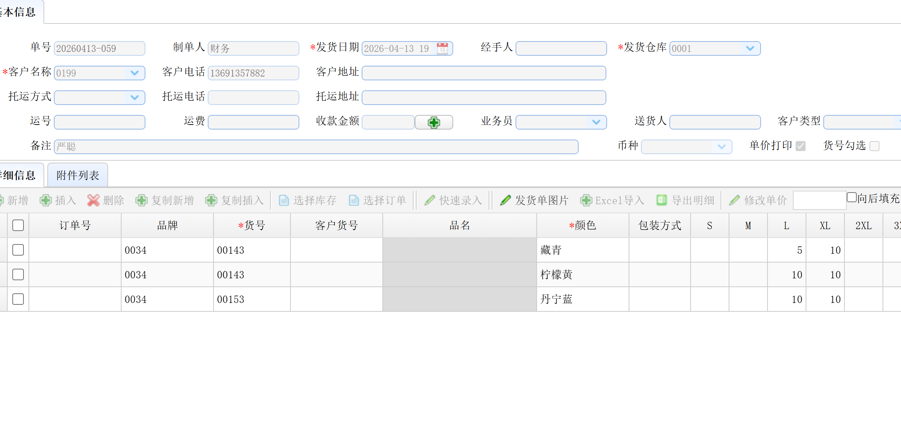
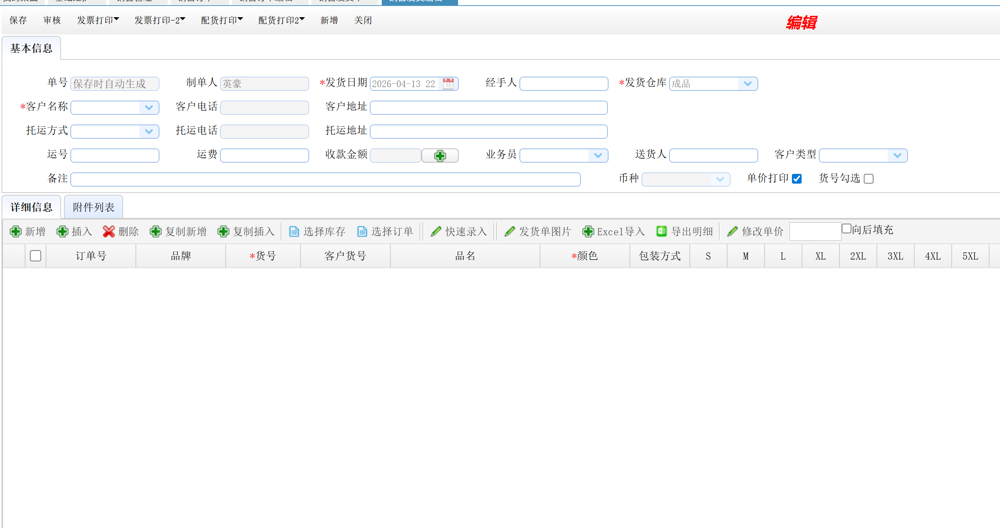
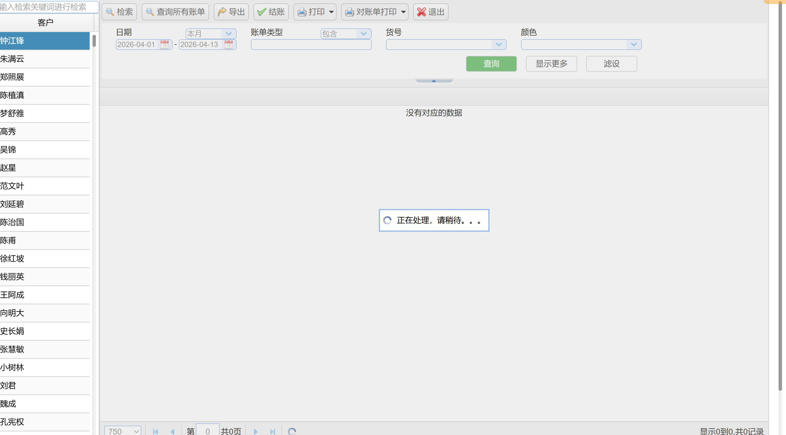

# ncloud2API 接口需求说明

> 原始需求来源：`需求表.xlsx`

## 接口清单

| # | 接口名称 | 实现效果 | 参考截图 | 预算 | 状态 |
|---|----------|----------|----------|------|------|
| 1 | 登录到系统 | 无特殊要求 | 无 | 20 | ✅ 已完成 |
| 2 | 获取销售订单列表 | 返回数组格式，含状态/客户/金额等字段 |  | 20 | ✅ 已完成 |
| 3 | 获取销售订单详细信息 | 与原页面字段一致，含基本信息+明细行（品牌/货号/颜色/S-5XL尺码/数量） |  | 25 | ✅ 已完成 |
| 4 | 添加销售单 | 输入页面所有可填字段，自动生成并保存销售单（等同页面手动操作后点保存） |  | 80 | ✅ 已完成 |
| 5 | 审核/作废销售单 | 对已有销售单执行审核或作废操作（额外支持反审） |  | 20 | ✅ 已完成 |
| 6 | 修改销售单 | 修改已存在销售单的信息 |  | 20 | ✅ 已完成 |
| 7 | 获取销售发货单列表 | 返回发货单列表，含审核状态/序号/单号/发货日期/客户名/地址等 |  | 20 | ✅ 已完成 |
| 8 | 获取销售发货单详细信息 | 含货号/颜色/S-5XL尺码数量等明细 |  | 25 | ✅ 已完成 |
| 9 | 添加销售发货单 | 与页面操作一模一样，参数需有完整文档 |  | 80 | ✅ 已完成 |
| 10 | 审核/反审/作废销售发货单 | 对已有发货单执行审核、反审或作废操作 |  | 20 | ✅ 已完成 |
| 11 | 修改发货单 | 修改已有发货单信息 |  | 20 | ✅ 已完成 |
| 12 | 获取销售对账单 | 输入客户名称 + 日期范围，返回对账列表（数组格式） |  | 30 | ✅ 已完成 |
| 13 | 未发货统计报表取消发货 | 对未发货报表中的行标记为手动完工 | — | — | ✅ 已完成 |
| 14 | 未发货统计报表还原订单 | 撤销取消发货操作，恢复订单行状态 | — | — | ✅ 已完成 |
| 15 | 成品总库存查询 | 按仓库/货号/颜色查询成品库存 | — | — | ✅ 已完成 |
| 16 | 查询未发货统计报表 | 按日期范围查询未发货统计数据 | — | — | ✅ 已完成 |

**完成进度：16/16 (100%)**

---

## 分组说明

### 销售订单（接口 2-6）
对应系统页面：`SalesManagement/ClothingOrderDd`

- 列表：分页返回，支持日期/状态过滤
- 详情：单号查询，返回主表 + 明细行
- 添加：提交基本信息 + 明细行，后台自动生成单号
- 审核/作废：传入单号 + 操作类型
- 修改：传入单号 + 变更字段

### 销售发货单（接口 7-11）
对应系统页面：`SalesManagement/ClothingOrderFhd`（待确认）

- 与销售订单结构类似，增加反审操作
- 添加时明细行需包含尺码（S/M/L/XL/2XL/3XL/4XL/5XL）

### 销售对账单（接口 12）
对应系统页面：对账单查询模块（见截图 extracted_img_1.png）

- 入参：客户名称、开始日期、结束日期
- 出参：数组，字段待抓包确认

### 未发货统计报表（接口 13-14, 16）
对应系统页面：`SalesManagement/ClothingOrderDd/WfhReport`

- 查询：按日期范围+客户/品牌/货号过滤，返回每行订单/发货/未发货数量及各尺码明细
- 取消发货：将报表行标记为手动完工（`CancelFh` sfwg=1）
- 还原订单：撤销手动完工（`CancelFh` sfwg=0）

### 成品总库存（接口 15）
对应系统页面：`CpHandwork/HandworkCpInventory/InventoryZReport`

- 按仓库/货号类别/货号/品名过滤
- 返回各颜色/尺码的库存数量、销售价、成本价、金额、在途数
